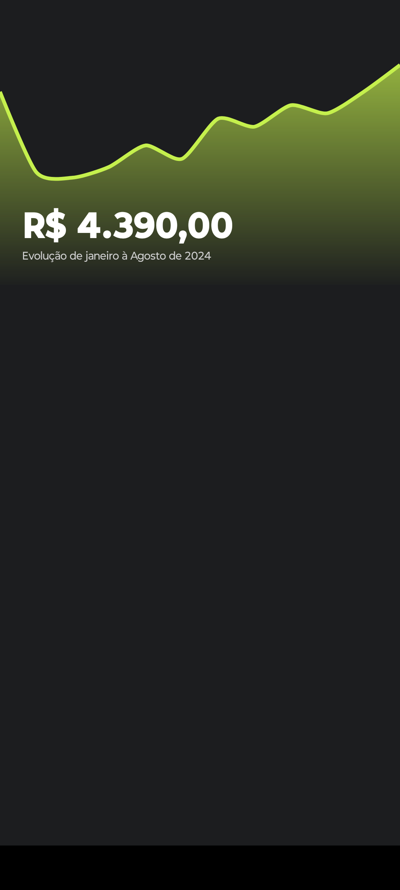
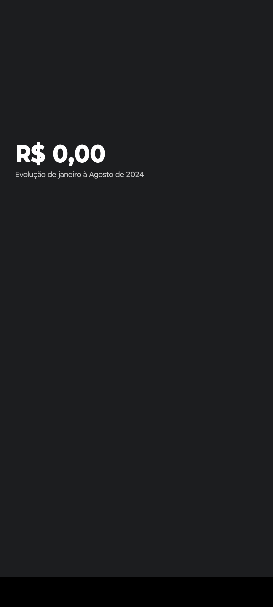
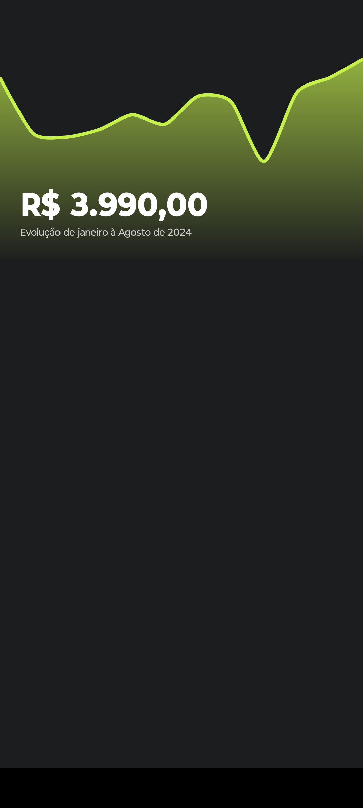

# React Native Calendar Mobile

<div style="display: flex; justify-content: space-between; margin-right: 6px; margin-top: 20px;">
  
  
  
</div>

# Expo App Setup

## Clonando o Repositório

Para começar a trabalhar neste projeto, siga as etapas abaixo:

1. **Clone o repositório:**

   Abra o terminal ou prompt de comando e execute o seguinte comando para clonar o repositório:

   ```bash
   git clone https://github.com/jefersonprimer/rngraph-mobile.git

2. **Acesse o diretório do projeto**
    ```bash
   cd rngraph-mobile

3. **Instalando as Dependências do Projeto**
      ```bash
   npm install

4. **Abra o projeto no VS Code**
      ```bash
   code .

5. **Para rodar o app**
      ```bash
   npm expo start

> **⚠️ AVISO:**  
> Antes de continuar, verifique se você tem o Node.js e a CLI do Expo instalados <br/>
> Certifique-se de consultar se foi instalado corretamente.
> 

1. **Instalar o Node.js**  
Se você ainda não tem o Node.js instalado, acesse o site oficial do <a href="https://nodejs.org/pt" target="_blank" style="color: blue;">Node.js</a> e baixe a versão mais recente.

2. **Instalar a CLI do Expo**
Para instalar a CLI do Expo, execute o seguinte comando globalmente:
  ```bash
   npm install -g expo-cli
